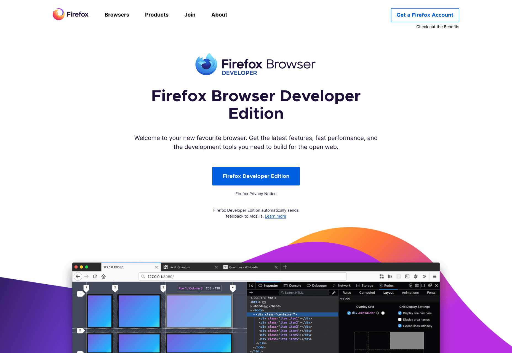
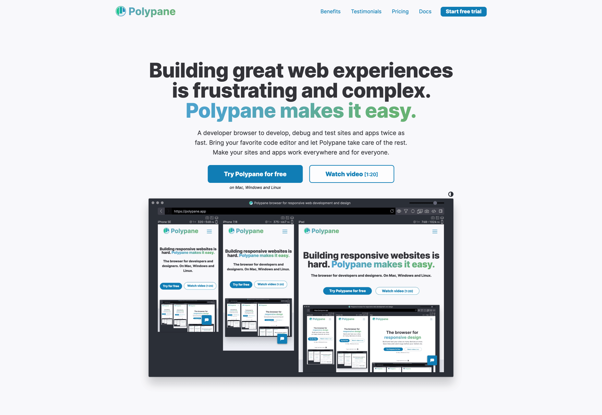

Browser bagi seorang web developer atau web programmer tidak hanya sekedar untuk browsing. Akan tetapi seorang developer membutuhkan browser yang mampu membantu memudahkan dalam proses ngoding.

Seorang developer membutuhkan browser yang dilengkapi feature atau addon khusus untuk debugging atau melihat hasil dari code yang dibuat.

Atau terkadang Anda membutuhkan browser untuk melihat bagaimana code Anda bekerja untuk device dengan ukuran yang berbeda. Misalnya tampilan di handphone atau tablet dan juga monitor dengan resolusi sedang atau yang lebih besar.

Pada umumnya browser biasa dan browser untuk developer tampak sama dari sisi tampilannya. Dan jika Anda menggunakan browser biasa kemungkinan akan memerlukan beberapa tambahan baik dari sisi feature standard ataupun aksi tertentu misalnya Click Kanan -> Inspect Element -> Toggle Device untuk melihat tampilan web Anda pada device tertentu.

Untung nya disini kami telah mengumpulkan 5 Browser khusus untuk Web Developer

* * *

## 1. Firefox Developer Edition

Firefox adalah browser yang dianggap jauh lebih cepat bagi sebagian developer, Dengan **Firefox Developer Edition** anda dapat melihat CSS Engine yang memudahkan anda meng-inspect code yang Anda buat dan banyak tambahan “Firefox DevTools” lainya untuk bisa ANda gunakan.

Firefox Developer Edition juga sangat bagus untuk digunakan debuging JavaScript, Master CSS Grid, dan feature lainya. Yang mana alat-alat ini sangat membantu untuk meningkatkan efektifitas web developer.

[Download Firefox Developer Edition](https://www.mozilla.org/en-GB/firefox/developer/)

* * *

## 2. Google Chrome for Developer

Google Chrome adalah salah satu browser yang paling banyak digunakan didunia. Berdasarkan perkiraan terbaru, Chrome memiliki lebih dari 58% market share. Dengan jumlah pengguna yang begitu banyak, tentunya Chrome memiliki keunggulan tersendiri yang mereka tawarkan bagi para pengguna nya.

Selain kepada pengguna umum, Chrome juga memiliki sesuatu yang istimewa bagi developer. Diantaranya adanya **Google Chrome For Developer** atau **Chrome Dev**.

Dengan tools dan juga Addon yang sangat banyak, Google Chrome For Developer menjadi pilihan menarik bagi web developer. Kemudahan debugging, Cutting-edge web platform API dan weekly update untuk memastikan Chrome dapat mengikuti perkembangan sebagai salah satu web development tool.

[Download Google Chrome Dev](https://www.google.com/chrome/dev/)

* * *

## 3. LambdaTest LT Browser

LambdaTest LT Browser adalah browser yang khusus dikembangkan untuk web developer untuk menguji responsifibiltas web yang sedang dibangun.

Gambar : Screenshot LambadaTest LT Browser

Browser ini menawarkan lebih dari 25 viewport yang berbeda dan ditambah custom viewport tentunya, berguna juga untuk menguji web lokal, bug tracking dan banyak lagi feature lainya.

Dengan LambadaTest LT browser, web developer akan dapat merancang web yang responsif dan berkinerja tinggi.

[Download LambadaTest LT Browser](https://www.lambdatest.com/lt-browser)

* * *

## 4. Polypane

Sebagaimana browser untuk developer lainya, polypane mengedepankan feature testing responsibilitas sebuah web, namun polypane sudah menanam semua feature development debuging kedalam sistem, sehingga Anda tidak perlu lagi menambahkan ekstensi debuging lainya.

Sayangnya, Polypane adalah browser yang berbayar. Namun banyak juga perusahaan besar seperti Envanto, AppSignal, Siemens juga menggunakan Polypane. Mungkin Anda juga patut mencoba Frree trial nya biar gak penasaran.

[Download Polypane](https://polypane.app/)

* * *

## 5. Blisk

Blisk adalah alternatif menarik untuk sebagian browser khusus developer. Terlebih secara feature menurut kami tidak jauh beda dengan Polypane yang merupakan browser berbayar.

Blisk adalah browser yang fokus untuk pengembang atau web developer. Anda bisa melihat tampilan web Anda dalam beberapa screen size yang berbeda sekali waktu.

Juga terdapat feature layaknya Chrome dan Firefox Dev untuk mengubah CSS secara live preview.

[Download Blisk](https://blisk.io/)

* * *

## Kesimpulan

Sebagai Web Developer, kita memerlukan alat-alat yang bisa meningkatkan efektifitas pekerjaan. Termasuk diantaranya kita juga memerlukan browser sebagai preview hasil karya kita. Dan tentunya bukan sekedar browser biasa, kita memerlukan browser sebagai sarana testing, debuging, dan keperluan lainya.

Maka, sebaiknya pilih browser yang khusus developer dengan pertimbangan efektifitas dan juga sebeberapa besar browser tersebut membantu pekerjaan kita.
