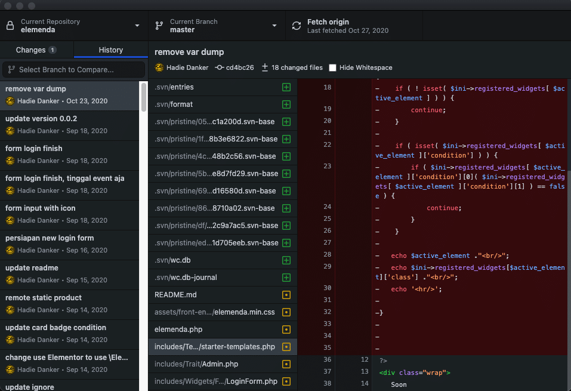

Jika sebelumnya kita telah membahas tentang perbedaan git dan github, maka kali ini kita akan membahas salah satu perlengkapan coding yang dapat memudahkan kita saat coding dan berkolaborasi dengan programmer lainya.

## Kenapa Harus Memakai Github Desktop?

Bagi anda yang belum terbiasa menggunakan `git` command, maka github desktop sangat membantu kita untuk commit, push atau pull code yang kita buat ke git platform.

Ya, github desktop tidak hanya bisa digunakan untuk platform github saja, akan tetapi bisa juga digunakan untuk Gitlab, ataupun bitbucket.

## Apa yang bisa dilakukan dengan Github Desktop?

So, apa aja yang bisa kita lakukan dengan github desktop yang dapat memudahkan kita untuk coding?

### History Tracking

Github desktop bisa digunakan untuk tracking perubahan apa saja perubahan code yang telah kita buat

Github desktop akan menampilkan file yang anda lakukan perubahan di dalamnya. kemudian kita bisa melakukan commit.

### Commit to Spesific Branch

Commit adalah sebuah perintah untuk memberikan catatan perubahan, bisa dilakukan dengan perintah git commit -m “isi pesan perubahan”, sementara di github desktop anda cukup mengisi pesan perubhan nya saja lalu tekan tombol commit

### Push to Spesific Branch

Setelah anda melakukan commit, tentunya code yang telah kita rubah harus di submit ke git platform. Biasa dilakukan dengan perintah `git push -u origin master` dimana master adalah branch tujuan code tersebut disubmit.

### Fetch and Pull

Jika kita melakukan kolaborasi, maka kita bisa melakukan fetch code baru yang disubmit oleh team kita. Kemudian melakukan Pull ke code yang telah kita buat.

Perintah yang biasa digunakan

`git fetch --all`

dan

`git pull --all`

### Membuat dan Pindah Branch

Branch atau Cabang adalah untuk kita memisahkan code. Misal kita membuat _development branch_ dan juga _master branch_ dan _release branch_. Atau bisa juga kita membuat branch untuk setiap versi dari code yang kita buat.

Dengan adanya branch ini, kita bisa memisahkan code yang kita buat agar lebih mudah pengelolaan nya ketika berkerja dengan team.

### Mengelola Banyak Project

Anda bisa dengan mudah mengelola banyak project sekaligus dengan mudah, pindah ke project lainpun dengan mudah.

## Kesimpulan

Github deskop memudahkan kita untuk berkolaborasi dan fokus pada code tanpa perlu menghafal git command.

Secara umum github desktop cukup bisa dihandalkan untuk perintah-perintah dasar github. Akan tetapi ada beberapa perintah yang tidak semua bisa di handle oleh github desktop seperti `git reset --hard HEAD` dan lain-lain.

Jika kamu merasa membutuhkan github desktop, langsung download saja disini ya [https://desktop.github.com](https://desktop.github.com)
