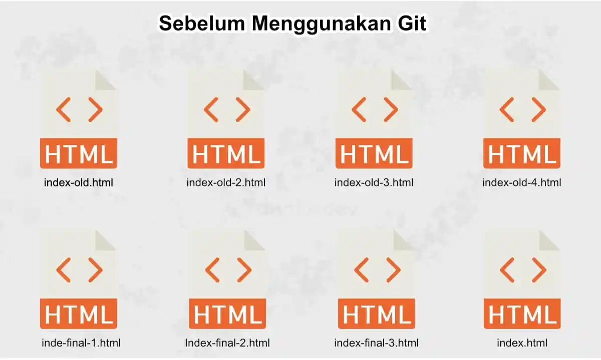
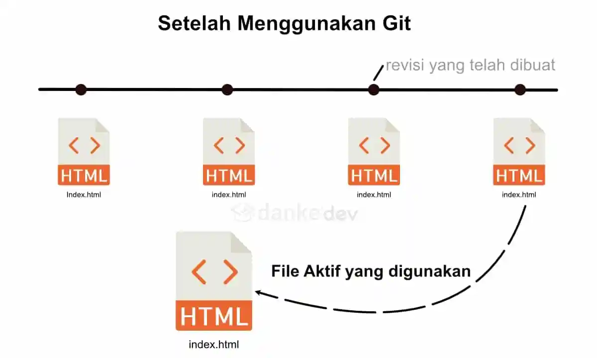

Git adalah perangkat lunak untuk memanagement versi _(Version Control System – disingkat VCS)_ diciptakan oleh Linus Torvalds, yang pada awalnya ditujukan untuk pengembangan kernel Linux.

Jadi dengan git, kita bisa menyimpan setiap update dari code yang kita buat, yang mungkin nantinya akan dapat kita gunakan untuk melihat versi-versi sebelumnya jika ada error atau hanya sekedar untuk melihat perubahan apa saja yang telah kita lakukan.

Dalam artikel ini, saya hanya akan membahas pengenalan git saja. Sedangkan untuk tutorial git secara lengkap akan saya update di lain waktu.

## Mengenal Git

Git dapat digunakan untuk mencatat setiap perubahan pada file yang kita kerjakan sendiri atau dengan beberapa orang (team).

Maka dari itu, Git dikenal juga dengan _distributed revision control_ (VCS terdistribusi), artinya penyimpanan database Git tidak hanya berada dalam satu tempat saja, yang memungkinkan kita dapat menulis code secara bersamaan dari berbagai komputer dan di push kedalam satu git server.

## Apa yang dilakukan oleh Git?

Seperti penjelasan diatas, bahwasanya git sebagai version control yang dapat memantau semua perubahan yang kita kirim kedalam server git.

Untuk mempermudah memahami fungsi git, mari kita lihat contoh pada gambar berikut ini:

Setelah kita menggunakan Version Control, maka kita tetap dapat menyimpan nama file yang sama dengan isi yang berbeda-beda.

Jadi, ketika kita menyimpan perubahan pada umumnya kita melakukan “Save As” kemudian menamai dengan nama yang berbeda-beda. Dengan git kita tidak perlu melakukan itu, cukup tandai dengan sebuah pesan “commit” kemudian kirim ke server git dengan nama yang sama. Maka kita dapat melihat perubahan apa saja pada file tersebut atau kita bisa juga menggunakan versi sebelumnya.

## Kenapa Git Penting Bagi Programmer?

Selain dapat digunakan menyimpan versi code yang telah kita buat, git juga memiliki banyak manfaat lain diantaranya:

1.  Menyimpan semua versi code yang kita buat
2.  Digunakan untuk kolaborasi dengan team
3.  Deploy ke server dengan lebih mudah
4.  Sebagai backup code ke dalam cloud
5.  Kembali ke versi sebelumnya (rollback) jika ada error, bisa dengan mudah

Dari sini, semoga Anda sudah paham seberapa penting manfaat git.

Perusahaan besar seperti Google, Facebook, Microsoft, Tokopedia, dan lain-lain juga menggunakan Git. Maka jika kamu punya impian bekerja di perusahaan besar sebagai programmer maka Wajib paham penggunaan Git atau Version Control lainya.